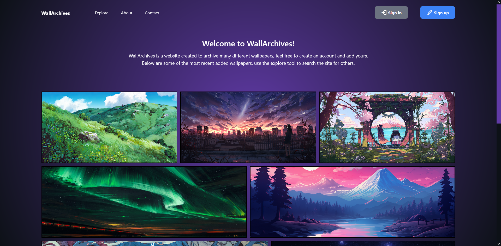

# WallArchives

This is a hobby project created with the purpose of practicing fullstack web dev. It allows for uploading wallpapers,
there's many similar websites like this, for example: https://wallhaven.cc/

## How to run

Use `npm run dev` to run the angular development server and `npm run server` to start the express.js backend.

## Seeding

I've included seeders in this project for testing purposes. Since this project uses mongodb cloud storage,
You will need to supply your own Mongo URI to connect. Once You've properly connected you can call
`npm run seed` to seed your db with sample wallpapers.

## Build

Run `ng build` to build the project. The build artifacts will be stored in the `dist/` directory.

## Running unit tests

Run `ng test` to execute the unit tests via [Karma](https://karma-runner.github.io).

## ----------------------

